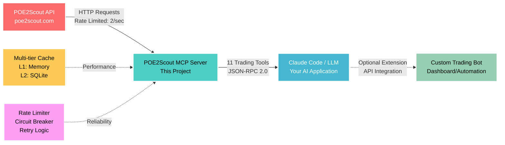

# POE2Scout MCP Server - Professional Trading Intelligence

A Model Context Protocol (MCP) server that provides AI assistants with professional trading data from POE2Scout - a specialized platform for Path of Exile 2 currency trading and market intelligence. Built for traders, day traders, and currency speculators who need reliable market data and trend analysis.

## Architecture Overview



**Data Flow:**
1. **POE2Scout API** → Raw market data (Divine Orbs, Chaos Orbs, etc.)
2. **MCP Server** → Processes, caches, and exposes 11 trading tools  
3. **Claude Code/LLM** → **YOUR PRIMARY APPLICATION** - Provides intelligent trading analysis
4. **Custom Extensions** → Optional bots/dashboards that integrate with Claude's analysis

## What This MCP Server Provides

### 🎯 **Reliable Data Pipeline**
- **11 focused tools** for direct POE2Scout API access
- **Rate-limited HTTP client** (2 req/sec, burst 5) with intelligent retry logic
- **Real-time market data** with proper error handling and caching
- **JSON-RPC 2.0 compliance** for seamless AI integration

### 📊 **Trading-Focused Data Coverage**
- **Major currencies only** - Divine Orb, Chaos Orb, and other high-volume items
- **Volume-based pricing** - Trade quantities for liquidity assessment
- **Price history with trends** - Essential for day trading decisions
- **Outlier detection** - Automatically flags market manipulation attempts
- **Professional trader tools** - Built for currency speculation, not casual gear shopping

## Available Tools

POE2Scout MCP provides 11 specialized tools for currency trading and market analysis:

### 🎯 **Core Trading Tools**
- **`analyze_price_history`** - Advanced market analysis with trend detection, volatility assessment, and trading signals
- **`get_leagues`** - Current league data with Divine Orb pricing
- **`basic_search`** - Find currency items by name with price history
- **`get_currency_items`** - Major currency exchange rates and volume data

### 📊 **Market Intelligence Tools**  
- **`get_unique_items`** - High-value unique item discovery (limited data coverage)
- **`get_item_categories`** - Available trading categories
- **`get_unique_base_items`** - Base item reference data
- **`get_uniques_by_base_name`** - Filter unique items by base type

### ⚙️ **System & Utility Tools**
- **`get_api_status`** - Rate limiting and system health monitoring
- **`get_item_filters`** - Available search filters and categories
- **`get_landing_splash_info`** - Platform status and featured content

**Key Limitation**: POE2Scout focuses on high-volume traded items only. Most specific gear searches return empty results - this is normal and expected.

## Professional Trading Applications

### 📊 **Smart Trading Analysis**
```
👤 User: Should I buy Divine Orbs at current market price?

🤖 POE2 AI: Let me analyze Divine Orb market conditions...
         [MCP call: analyze_price_history → comprehensive analysis]
         
         📈 MARKET ANALYSIS:
         • Current Price: [Current market rate]
         • Trend: Stable/Flat (medium volatility)
         • Volume: 302 quantity (excellent liquidity)
         • Recommendation: Sell - 13.8% above average
         
         💡 TRADING SIGNAL: WEAK SELL
         ⚠️ Price slightly elevated - consider waiting for dip
         📊 Recent range: [Dynamic price range]
```

### 🎯 **Professional Currency Strategy**  
```
👤 User: I have 3 Divine Orbs - what's the smartest trading strategy?

🤖 POE2 AI: Let me analyze current market conditions first...
         [MCP call: get_currency_items → market analysis]
         
         💰 STRATEGY ANALYSIS:
         • Divine stability: [Current volatility assessment]
         • Alternative currencies: [High-value options analysis] 
         • Market timing: [League phase considerations]
         
         📊 METHODOLOGY:
         • Assess your gear upgrade timeline
         • Compare Divine vs other currency stability  
         • Factor in league age and market maturity
         • Keep emergency reserves for opportunities
```

### 🔍 **Volume-Based Intelligence**
```
👤 User: Divine Orb shows 302 quantity - is that good liquidity?

🤖 POE2 AI: Moderate liquidity analysis:
         • 302 quantity = [Market value worth of trading]
         • Previous volume: 5,012 (significant drop)
         • Execution: May take time for large trades
         
         📊 VOLUME GUIDE:
         🔥 HIGH (1000+): Instant execution
         ✅ MEDIUM (100-999): Normal trading
         ⚠️ LOW (<100): Price manipulation risk
```

### 📊 **Arbitrage Opportunities**
```
👤 User: Find arbitrage between leagues

🤖 POE2 AI: Cross-league price analysis:
         
         💎 DIVINE ORB ARBITRAGE:
         • Dawn of the Hunt: [Current SC price]
         • HC Dawn of the Hunt: [Current HC price]
         • Spread: [Price difference] ([% difference])
         
         📊 ANALYSIS:
         • Hardcore economy typically smaller
         • Can't transfer between leagues
         • Shows relative economy health
```

### ⚡ **Price Manipulation Detection**
```
👤 User: [Currency] just spiked massively - is this real?

🤖 POE2 AI: Market manipulation analysis:
         
         🚨 PRICE SPIKE ANALYSIS:
         • Current: [Spike price] (massive increase!)
         • Previous: [Normal range] (historical average)
         • Volume: [Current volume] (check if artificial)
         
         💡 VERDICT: [Analysis based on volume/history]
         ⚠️ Compare with historical patterns
         📊 Historical range: [Dynamic range]
```

### 💰 **Quick Trade Validation**
```
👤 User: Someone offers [X] for [Y currency] - fair deal?

🤖 POE2 AI: Trade analysis:
         
         [DEAL ASSESSMENT]
         📊 Current market rate: [Live market rate]
         💰 Price difference: [Above/below market %]
         📈 Recent range: [Dynamic price range]
         
         🎯 RECOMMENDATION: [Based on current analysis]
```

## Real Trading Scenarios

### **Beginner: "What's Exalted worth?"**
```
Current Exalted Orb: 1 exalt (base unit)
Stable baseline currency for all pricing
Volume: High liquidity
Status: Standard measurement unit
```

### **Intermediate: "Best profit margins today?"**
```
🔥 HIGH-VALUE CURRENCIES:
1. Divine Orb: [Current rate] (stable store of value)
2. Perfect Jeweller's: [Current rate] (high-value)
3. Greater Jeweller's: [Current rate] (watch for spikes)

⚠️ Check volumes before trading!
```

### **Advanced: "Portfolio rebalancing methodology?"**
```
CURRENT HOLDINGS: 8 Divine Orbs (typical geared endgamer)

ANALYSIS FRAMEWORK:
• Market phase: [Early league vs established economy]
• Currency stability: [Volatility vs other options]
• Personal timeline: [Gear upgrade plans vs investment horizon]

METHODOLOGY: 
• Calculate gear upgrade costs in current market
• Assess opportunity cost of holding vs trading
• Diversify based on market conditions, not fixed ratios
• Adjust allocation based on league maturity and goals
```

## Installation

### For Claude Desktop Users
```bash
# Add to Claude with email configuration
claude mcp add -e POE2SCOUT_CONTACT_EMAIL=your@email.com -- poe2scout-mcp node /path/to/dist/index.js
```

### For Developers
```bash
git clone https://github.com/vanzan01/poe2scout-mcp.git
cd poe2scout-mcp
npm install
npm run build

# Set email (required by API)
export POE2SCOUT_CONTACT_EMAIL="your@email.com"
```

## Troubleshooting

### **"Prices look completely wrong"**
- Check the volume/quantity - low volume = unreliable price
- Trust high-volume items only (100+ quantity)
- Some currencies show data anomalies - focus on consistent patterns

### **"All unique item searches return empty"**
- Normal behavior - POE2Scout focuses on currency trading
- Limited unique item coverage
- Use official trade site for gear

### **"Divine price changed drastically"**
- Check both price AND volume
- Volume drops = temporary liquidity issue  
- Wait for volume normalization before trading large amounts

## Pro Trading Tips

1. **Always check volume** - Volume under 100 = price manipulation risk
2. **Divine Orb is your benchmark** - Most stable high-value currency  
3. **Exalted for baseline** - All prices measured in exalts
4. **Perfect Jeweller's for storage** - High value, good liquidity
5. **Cross-reference big trades** - Verify large value transactions

## Data Quality Notes

**✅ Reliable Data:**
- Divine Orb pricing (consistently accurate)
- Volume/quantity data (helps identify bad prices)  
- Price history trends

**⚠️ Known Issues:**
- Some currencies show extreme price swings
- Low volume items may have stale pricing
- Not real-time (updates periodically)

## Credits

Built on top of [POE2Scout](https://github.com/poe2scout/poe2scout) - the platform providing the trading data that makes this possible.

## License

MIT