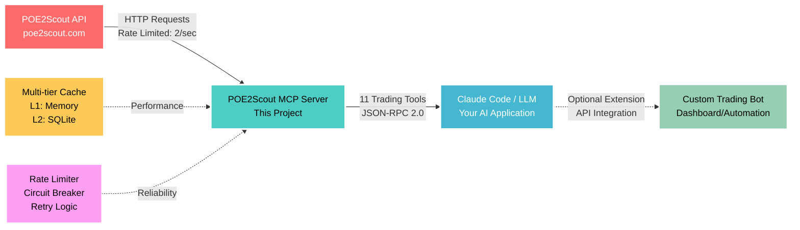

# POE2Scout MCP Server - Professional Trading Intelligence

A Model Context Protocol (MCP) server that provides AI assistants with professional trading data from POE2Scout - a specialized platform for Path of Exile 2 currency trading and market intelligence. Built for traders, day traders, and currency speculators who need reliable market data and trend analysis.

## Architecture Overview



**Data Flow:**
1. **POE2Scout API** → Raw market data (Divine Orbs, Chaos Orbs, etc.)
2. **MCP Server** → Processes, caches, and exposes 11 trading tools  
3. **Claude Code/LLM** → **YOUR PRIMARY APPLICATION** - Provides intelligent trading analysis
4. **Custom Extensions** → Optional bots/dashboards that integrate with Claude's analysis

## What This MCP Server Provides

### 🎯 **Reliable Data Pipeline**
- **11 focused tools** for direct POE2Scout API access
- **Rate-limited HTTP client** (2 req/sec, burst 5) with intelligent retry logic
- **Real-time market data** with proper error handling and caching
- **JSON-RPC 2.0 compliance** for seamless AI integration

### 📊 **Trading-Focused Data Coverage**
- **Major currencies only** - Divine Orb, Chaos Orb, and other high-volume items
- **Volume-based pricing** - Trade quantities for liquidity assessment
- **Price history with trends** - Essential for day trading decisions
- **Outlier detection** - Automatically flags market manipulation attempts
- **Professional trader tools** - Built for currency speculation, not casual gear shopping

## Available Tools

POE2Scout MCP provides 11 specialized tools for currency trading and market analysis:

### 🎯 **Core Trading Tools**
- **`analyze_price_history`** - Advanced market analysis with trend detection, volatility assessment, and trading signals
- **`get_leagues`** - Current league data with Divine Orb pricing
- **`basic_search`** - Find currency items by name with price history
- **`get_currency_items`** - Major currency exchange rates and volume data

### 📊 **Market Intelligence Tools**  
- **`get_unique_items`** - High-value unique item discovery (limited data coverage)
- **`get_item_categories`** - Available trading categories
- **`get_unique_base_items`** - Base item reference data
- **`get_uniques_by_base_name`** - Filter unique items by base type

### ⚙️ **System & Utility Tools**
- **`get_api_status`** - Rate limiting and system health monitoring
- **`get_item_filters`** - Available search filters and categories
- **`get_landing_splash_info`** - Platform status and featured content

**Key Limitation**: POE2Scout focuses on high-volume traded items only. Most specific gear searches return empty results - this is normal and expected.

## Professional Trading Applications

### 📊 **Smart Trading Analysis**
```
👤 User: Should I buy Divine Orbs at 2000 chaos right now?

🤖 POE2 AI: Let me analyze Divine Orb market conditions...
         [MCP call: analyze_price_history → comprehensive analysis]
         
         📈 MARKET ANALYSIS:
         • Current Price: 2,000 chaos
         • Trend: Stable/Flat (low volatility)
         • Volume: 4,966 quantity (high liquidity)
         • Recommendation: Fair Value - Hold/Neutral
         
         💡 TRADING SIGNAL: NEUTRAL
         ✅ Safe to buy at current prices
         📊 Consider dollar-cost averaging for large purchases
```

### 🎯 **Professional Currency Strategy**  
```
👤 User: I have 5,000 chaos - what's the smartest trading strategy?

🤖 POE2 AI: Based on current market conditions:
         
         💰 PORTFOLIO ALLOCATION:
         • 80% Divines (4,000 chaos) → Stability & high liquidity
         • 20% Chaos (1,000 chaos) → Trading opportunities
         
         📊 RATIONALE:
         • Divine volume: 4,966 quantity = easy exit
         • Stable store of value for large holdings
```

### 🔍 **Volume-Based Intelligence**
```
👤 User: Divine Orb shows 4,966 quantity - what does that mean?

🤖 POE2 AI: High-volume trading intelligence:
         • 4,966 quantity = ~9,932,000 chaos worth of trading
         • High liquidity = easy to buy/sell at market price
         • Fast execution - won't wait long for buyers/sellers
         
         📊 VOLUME GUIDE:
         🔥 HIGH (1000+): Safe for large trades
         ⚠️ LOW (<100): Price manipulation risk
         ❌ ZERO: No real market exists
```

### 📊 **Market Anomaly Detection**
```
👤 User: I'm seeing weird Chaos Orb data showing 18,000 in the price history - what's happening?

🤖 POE2 AI: Let me analyze that anomaly in our market data...
         [MCP call: basic_search → "chaos" shows price history with outliers]
         
         🚨 DATA ANOMALY DETECTED!
         📊 Normal Chaos Orb price: 2 chaos (consistent baseline)  
         📈 Anomaly spike: 18,000 chaos value recorded (9000x normal!)
         📊 Trading pattern: 2 chaos (quantity: 14), then 18,000 spike (quantity: 45)
         
         🎯 ANALYSIS: 
         • Likely API data error or reporting glitch
         • 123 chaos spike also detected in history
         • Normal trading continues at 2 chaos baseline
         
         💡 INSIGHT: This shows why volume matters
         ✅ Trust: 2 chaos price with consistent 14+ quantity
         ❌ Ignore: Outlier spikes with unusual patterns
```

### ⚡ **Professional Trade Validation**
```
👤 User: Someone wants to trade 1 Divine for 1800 Chaos - fair deal?

🤖 POE2 AI: Let me analyze this against current market data...
         [MCP call: Divine Orb shows 2000c current, 4,966 volume, price history]
         
         💚 EXCELLENT DEAL FOR YOU!
         📊 Market rate: 2000 chaos per Divine (high volume confirms accuracy)
         💰 Discount: 200 chaos (10% below market)
         📈 Recent range: 1800-2100 chaos (you're at the low end)
         🔥 Volume: 4,966 quantity traded = liquid market
         
         ✅ RECOMMENDATION: Accept immediately!
         💡 Likely reasons: Quick liquidation, prefers chaos liquidity

👤 User: Should I accept this deal immediately or negotiate?

🤖 POE2 AI: With high-volume market data supporting 2000 chaos:
         ⚡ ACCEPT IMMEDIATELY - This is below market rate
         📊 High volume (4,966) means you can easily find market-rate trades
         💡 This trader is giving you a 10% discount for quick liquidity
         🎯 No need to negotiate when you're already getting a deal
```

### 💱 **Professional Currency Conversion**
```
👤 User: I want to convert 1,000 chaos into more stable holdings. What's the best approach?

🤖 POE2 AI: Smart liquidity management question! Let me analyze...
         [MCP call: analyze_price_history for major currencies]
         
         📊 CONVERSION ANALYSIS:
         
         💰 Current Options:
         • 1,000 chaos → 0.5 Divine Orbs (2000c each)
         • Volume check: Divine shows 4,966 quantity (extremely liquid)
         • Risk level: LOW (stable price history)
         
         🎯 PROFESSIONAL RECOMMENDATION:
         ✅ Convert 50% (500 chaos → 0.25 Divine) for stability  
         ✅ Keep 50% (500 chaos) for trading flexibility
         
         📈 RATIONALE:
         • Divine: Store of value, easy to liquidate (high volume)
         • Chaos: Needed for smaller trades and opportunities
         • Balanced approach reduces risk while maintaining flexibility

👤 User: What about timing the market?

🤖 POE2 AI: Volume-based timing strategy:
         📊 HIGH VOLUME periods (4000+ quantity) = good liquidity for large moves
         📈 STABLE PRICING periods = safe conversion times  
         ⚠️ LOW VOLUME periods = wait for better liquidity
         💡 RULE: Convert during high-volume, stable price periods
```

### 🎓 **Currency Management for New Traders**
```
👤 User: I'm new to trading and have 500 chaos. How should I manage this?

🤖 POE2 AI: Smart starting position! Let me show you currency management...
         [MCP call: get_currency_items for major currencies]
         
         💰 CURRENCY STRATEGY FOR 500 CHAOS:
         
         ❌ MISTAKE: Trying to buy specific gear (POE2Scout doesn't track most items)
         ✅ SMART MOVE: Focus on currency portfolio management
         
         🎯 RECOMMENDED ALLOCATION:
         • Keep 400 chaos liquid (80%) for trading opportunities
         • Consider 0.25 Divine Orb position (100 chaos) for stability
         • Reason: Divine = stable store of value, Chaos = trading flexibility
         
         📊 LEARN THE MARKET:
         • Divine Orb: 2000 chaos (high volume = liquid)
         • Track volume patterns to understand market depth
         • Avoid items with zero volume (no real market)

👤 User: Should I try to flip currencies?

🤖 POE2 AI: With 500 chaos, focus on learning first:
         📚 EDUCATION PHASE: Study price patterns before risking capital
         📊 SMALL TESTS: Try 50-100 chaos positions to learn
         ⚠️ AVOID: Large positions until you understand volume/volatility
         🎯 GOAL: Build trading experience, not immediate profits
```

## Installation & Setup

```bash
# Clone and build
git clone https://github.com/vanzan01/poe2scout-mcp.git
cd poe2scout-mcp
npm install
npm run build
```

## Integration Examples

### Claude Code (Recommended)
```bash
# The -e flag passes the email directly to MCP - no separate export needed!
claude mcp add -e POE2SCOUT_CONTACT_EMAIL=your@email.com -- poe2scout-mcp node /path/to/dist/index.js
```

### Manual/Development Usage
```bash
# Only needed if running outside Claude Code
export POE2SCOUT_CONTACT_EMAIL="your-email@example.com"

# Or create .env file
echo "POE2SCOUT_CONTACT_EMAIL=your-email@example.com" > .env
```


## Requirements

- **Node.js 18+**  
- **TypeScript 5.9+**
- **Internet connection** for POE2Scout API
- **Valid email** for API compliance

## Acknowledgments

This MCP server connects to and relies on the excellent **POE2Scout** project:

- **POE2Scout** - https://github.com/poe2scout/poe2scout  
  The core trading platform and API that powers this MCP server. POE2Scout provides the market data, price history, and trading intelligence that makes professional POE2 currency analysis possible.

Special thanks to the POE2Scout team for building and maintaining the infrastructure that enables AI-powered trading analysis for Path of Exile 2.

## License

MIT License