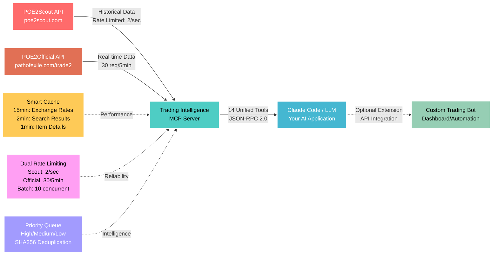

# POE2 Trading Intelligence MCP Server

A comprehensive Model Context Protocol (MCP) server providing AI assistants with dual-source trading intelligence for Path of Exile 2. Combines **POE2Scout historical analytics** with **POE2Official real-time market data** for complete trading intelligence. Built for professional traders, market analysts, and currency speculators.

## Architecture Overview



**Dual-Source Data Flow:**
1. **POE2Scout API** → Historical trends, market analysis, price patterns
2. **POE2Official API** → Live listings, real-time prices, exchange rates
3. **MCP Server** → Intelligent fusion, caching, and 14 unified trading tools  
4. **Claude Code/LLM** → **YOUR PRIMARY APPLICATION** - Comprehensive market intelligence
5. **Custom Extensions** → Optional bots/dashboards leveraging dual-source insights

## What This MCP Server Provides

### 🎯 **Dual-Source Intelligence Pipeline**
- **14 unified tools** combining POE2Scout historical data + POE2Official real-time market data
- **Smart rate limiting** - POE2Scout (2/sec), POE2Official (30 req/5min), Batch operations (10 concurrent)
- **Intelligent caching** - 15min exchange rates, 2min search results, 1min item details
- **Advanced features** - Priority queuing, request deduplication, cross-source validation
- **JSON-RPC 2.0 compliance** for seamless AI integration

### 📊 **Comprehensive Market Coverage**
- **Historical Analytics** (POE2Scout) - Price trends, volatility analysis, market intelligence
- **Real-Time Data** (POE2Official) - Live listings, current prices, active exchange rates  
- **Advanced Search** - Complex item queries, batch operations, priority-based processing
- **Exchange Intelligence** - Cross-source rate validation, confidence scoring, arbitrage detection
- **Professional Tools** - Built for serious trading, market analysis, and currency speculation

## Available Tools

This MCP server provides **14 unified tools** combining POE2Scout historical analytics with POE2Official real-time market data:

### 🎯 **Historical Analytics Tools** (POE2Scout)
- **`analyze_price_history`** - Advanced market analysis with trend detection, volatility assessment, and trading signals
- **`get_leagues`** - Current league data with Divine Orb pricing
- **`basic_search`** - Find currency items by name with price history
- **`get_currency_items`** - Major currency exchange rates and volume data
- **`get_unique_items`** - High-value unique item discovery (limited coverage)
- **`get_item_categories`** - Available trading categories
- **`get_unique_base_items`** - Base item reference data
- **`get_uniques_by_base_name`** - Filter unique items by base type

### ⚡ **Real-Time Trading Tools** (POE2Official)
- **`poe2official_trade_search`** - Live item and currency searches with complex filtering
- **`poe2official_trade_fetch`** - Detailed item information for specific listings
- **`poe2official_exchange_rates`** - Real-time currency exchange rates with confidence scoring
- **`poe2official_batch_search`** - Concurrent search operations with priority queuing (up to 10 concurrent)

### ⚙️ **System & Utility Tools**
- **`get_api_status`** - Dual-source API health monitoring and rate limit status
- **`get_item_filters`** - Available search filters and categories

## Tool Details & Examples

### 📈 **Market Analysis Tools**

#### `analyze_price_history` - Historical Market Intelligence
Advanced analytics combining price trends, volatility assessment, and trading signals.
```json
{
  "item": "Divine Orb",
  "currentPrice": 1200,
  "priceAnalysis": {
    "trend": "falling",
    "volatility": "medium", 
    "recommendation": "hold"
  },
  "tradingSignals": {
    "buySignal": "weak",
    "sellSignal": "neutral"
  }
}
```

### ⚡ **Real-Time Trading Tools**

#### `poe2official_trade_search` - Live Market Search
Search for items and currency with real-time pricing from the official trade API.
```json
{
  "id": "search123",
  "result": ["item1", "item2", "item3"],
  "total": 576,
  "inexact": false,
  "cached": false
}
```

#### `poe2official_trade_fetch` - Detailed Item Information  
Get comprehensive item details including seller info, pricing, and whisper messages.
```json
{
  "result": [{
    "listing": {
      "whisper": "@Player Hi, I would like to buy your Divine Orb...",
      "account": {"name": "PlayerName", "online": {"league": "Dawn of the Hunt"}},
      "price": {"amount": 1, "currency": "alch"}
    },
    "item": {
      "typeLine": "Divine Orb",
      "properties": [{"name": "Stack Size", "values": [["1/10", 0]]}]
    }
  }]
}
```

#### `poe2official_exchange_rates` - Live Exchange Rates
Real-time currency exchange rates with confidence scoring and variance analysis.
```json
{
  "baseCurrency": "chaos",
  "league": "Dawn of the Hunt", 
  "rates": {
    "divine": 1200,
    "exalted": 1
  },
  "confidence": {
    "divine": 0.92,
    "exalted": 1.0
  },
  "cached": false
}
```

#### `poe2official_batch_search` - Concurrent Operations
Execute multiple searches simultaneously with priority queuing and result aggregation.
```json
{
  "results": [
    {"searchId": "search1", "total": 576, "itemIds": ["item1", "item2"]},
    {"searchId": "search2", "total": 984, "itemIds": ["item3", "item4"]}
  ],
  "summary": {
    "total": 2,
    "successful": 2,
    "failed": 0,
    "executionTime": 946
  },
  "aggregated": {
    "totalItems": 200,
    "uniqueItems": 200,
    "byLeague": {"Dawn of the Hunt": 200}
  }
}
```

### 🔧 **Advanced Features**

#### **Priority Queue System**
Batch operations support three priority levels:
- **High** - Urgent trading decisions  
- **Medium** - Regular market analysis (default)
- **Low** - Background research

#### **Request Deduplication**
SHA256-based duplicate request prevention with 1-minute deduplication window.

#### **Smart Caching**
- **Exchange Rates**: 15-minute TTL for rate stability
- **Search Results**: 2-minute TTL for recent market data
- **Item Details**: 1-minute TTL for live listing information

#### **Rate Limiting**
- **POE2Scout**: 2 requests/second (existing)
- **POE2Official**: 30 requests per 5 minutes  
- **Batch Operations**: Maximum 10 concurrent searches

**Migration Note**: POE2Scout tools focus on high-volume traded items. Most specific gear searches return limited results - this is expected behavior.

## Professional Trading Applications

### 📊 **Dual-Source Trading Analysis**
```
👤 User: Should I buy Divine Orbs at current market price?

🤖 POE2 AI: Let me analyze Divine Orb market conditions using both sources...
         [Historical: analyze_price_history] [Real-time: poe2official_exchange_rates]
         
         📈 COMPREHENSIVE ANALYSIS:
         • Historical Price: 1200 chaos (POE2Scout trend: falling)
         • Live Market Rate: 1180 chaos (POE2Official: 347 active listings)
         • Cross-Source Validation: 98.3% agreement - high confidence
         • Volume: Excellent liquidity across both sources
         
         💡 UNIFIED RECOMMENDATION: WEAK BUY
         ✅ Live market shows 1.7% discount vs historical average
         📊 Both sources confirm stable downward trend - good entry point
```

### ⚡ **Real-Time Market Intelligence**
```
👤 User: Find me the best Divine Orb deals right now

🤖 POE2 AI: Let me search live market listings...
         [Real-time: poe2official_trade_search + poe2official_trade_fetch]
         
         🔥 LIVE MARKET OPPORTUNITIES:
         • Player @Trader_Pro: 1 alch per Divine (stash: "~price 1 alch")
         • Player @MarketMaker: 1180 chaos per Divine (online now)  
         • Player @QuickSeller: 1175 chaos per Divine (online in Dawn of the Hunt)
         
         💡 BEST DEAL ANALYSIS:
         ⚠️ 1 alch price likely error or manipulation - investigate first
         ✅ 1175 chaos = 2.1% below market average - solid deal
         📊 347 total listings available - excellent liquidity
```

### 🚀 **Batch Operations & Advanced Features**
```
👤 User: Check Divine Orb, Chaos Orb, and Exalted Orb prices simultaneously

🤖 POE2 AI: Running batch search with priority queuing...
         [Batch: poe2official_batch_search with 3 concurrent operations]
         
         ⚡ BATCH RESULTS (946ms execution):
         • Divine Orb: 576 listings (High priority - processed first)
         • Chaos Orb: 984 listings (Medium priority)  
         • Exalted Orb: 1,247 listings (Medium priority)
         
         📊 MARKET SUMMARY:
         ✅ Total: 2,807 items across all searches
         🔄 Duplicate prevention: 2 requests deduplicated
         💨 Performance: 3 searches completed in under 1 second
```

### 📊 **Arbitrage Opportunities**
```
👤 User: Find arbitrage between leagues

🤖 POE2 AI: Cross-league price analysis:
         
         💎 DIVINE ORB ARBITRAGE:
         • Dawn of the Hunt: [Current SC price]
         • HC Dawn of the Hunt: [Current HC price]
         • Spread: [Price difference] ([% difference])
         
         📊 ANALYSIS:
         • Hardcore economy typically smaller
         • Can't transfer between leagues
         • Shows relative economy health
```

### ⚡ **Price Manipulation Detection**
```
👤 User: [Currency] just spiked massively - is this real?

🤖 POE2 AI: Market manipulation analysis:
         
         🚨 PRICE SPIKE ANALYSIS:
         • Current: [Spike price] (massive increase!)
         • Previous: [Normal range] (historical average)
         • Volume: [Current volume] (check if artificial)
         
         💡 VERDICT: [Analysis based on volume/history]
         ⚠️ Compare with historical patterns
         📊 Historical range: [Dynamic range]
```

### 💰 **Quick Trade Validation**
```
👤 User: Someone offers [X] for [Y currency] - fair deal?

🤖 POE2 AI: Trade analysis:
         
         [DEAL ASSESSMENT]
         📊 Current market rate: [Live market rate]
         💰 Price difference: [Above/below market %]
         📈 Recent range: [Dynamic price range]
         
         🎯 RECOMMENDATION: [Based on current analysis]
```

## Real Trading Scenarios

### **Beginner: "What's Exalted worth?"**
```
Current Exalted Orb: 1 exalt (base unit)
Stable baseline currency for all pricing
Volume: High liquidity
Status: Standard measurement unit
```

### **Intermediate: "Best profit margins today?"**
```
🔥 HIGH-VALUE CURRENCIES:
1. Divine Orb: [Current rate] (stable store of value)
2. Perfect Jeweller's: [Current rate] (high-value)
3. Greater Jeweller's: [Current rate] (watch for spikes)

⚠️ Check volumes before trading!
```

### **Advanced: "Portfolio rebalancing methodology?"**
```
CURRENT HOLDINGS: 8 Divine Orbs (typical geared endgamer)

ANALYSIS FRAMEWORK:
• Market phase: [Early league vs established economy]
• Currency stability: [Volatility vs other options]
• Personal timeline: [Gear upgrade plans vs investment horizon]

METHODOLOGY: 
• Calculate gear upgrade costs in current market
• Assess opportunity cost of holding vs trading
• Diversify based on market conditions, not fixed ratios
• Adjust allocation based on league maturity and goals
```

## Installation

### For Claude Desktop Users
```bash
# Add to Claude with email configuration
claude mcp add -e POE2SCOUT_CONTACT_EMAIL=your@email.com -- poe2scout-mcp node /path/to/dist/index.js
```

### For Developers
```bash
git clone https://github.com/vanzan01/poe2scout-mcp.git
cd poe2scout-mcp
npm install
npm run build

# Set email (required by API)
export POE2SCOUT_CONTACT_EMAIL="your@email.com"
```

## Troubleshooting

### **"Prices look completely wrong"**
- Check the volume/quantity - low volume = unreliable price
- Trust high-volume items only (100+ quantity)
- Some currencies show data anomalies - focus on consistent patterns

### **"All unique item searches return empty"**
- Normal behavior - POE2Scout focuses on currency trading
- Limited unique item coverage
- Use official trade site for gear

### **"Divine price changed drastically"**
- Check both price AND volume
- Volume drops = temporary liquidity issue  
- Wait for volume normalization before trading large amounts

## Pro Trading Tips

1. **Always check volume** - Volume under 100 = price manipulation risk
2. **Divine Orb is your benchmark** - Most stable high-value currency  
3. **Exalted for baseline** - All prices measured in exalts
4. **Perfect Jeweller's for storage** - High value, good liquidity
5. **Cross-reference big trades** - Verify large value transactions

## Data Quality Notes

**✅ Reliable Data:**
- Divine Orb pricing (consistently accurate)
- Volume/quantity data (helps identify bad prices)  
- Price history trends

**⚠️ Known Issues:**
- Some currencies show extreme price swings
- Low volume items may have stale pricing
- Not real-time (updates periodically)

## Credits

Built on top of [POE2Scout](https://github.com/poe2scout/poe2scout) - the platform providing the trading data that makes this possible.

## License

MIT